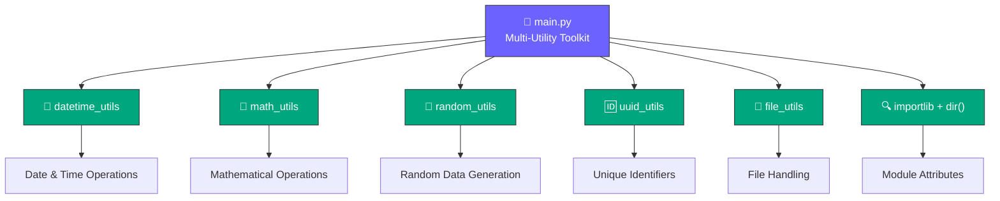
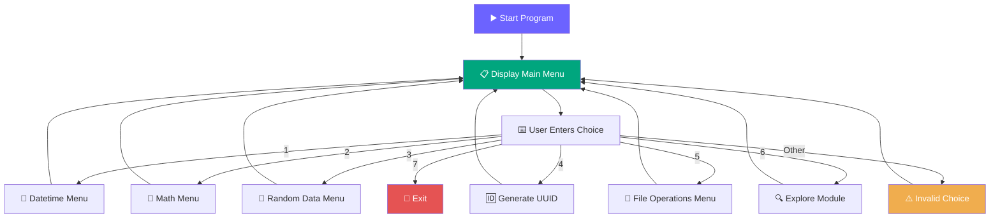

# Moduler-Packager<div align="center">

# 🚀 Multi-Utility Toolkit

### 🧰 A Powerful Python Toolkit for Everyday Utility Operations

<p>
  
  
  
  
</p>

<p>
  <strong>📅 Date & Time</strong> •
  <strong>🧮 Mathematics</strong> •
  <strong>🎲 Random Data</strong> •
  <strong>🆔 UUID</strong> •
  <strong>📁 File Handling</strong> •
  <strong>🔍 Module Exploration</strong>
</p>

<br>


</div>

---

## 🌟 About The Project

**Multi-Utility Toolkit** is a menu-driven Python application that brings several useful operations together inside one simple command-line interface.

Instead of creating separate programs for different tasks, this project organizes utilities into custom modules such as:

- 📅 `datetime_utils` — Date and time operations
- 🧮 `math_utils` — Mathematical calculations
- 🎲 `random_utils` — Random data generation
- 🆔 `uuid_utils` — Unique identifier generation
- 📁 `file_utils` — File operations
- 🔍 `importlib` + `dir()` — Dynamic module exploration

The project demonstrates important Python concepts including **modules, packages, functions, imports, exception handling, loops, menus, dynamic imports, and code organization**.

---

## 🎯 Project Highlights

| Feature | Description |
|---|---|
| 📅 Date & Time | Perform useful date/time related operations |
| 🧮 Mathematics | Access mathematical utility functions |
| 🎲 Random Data | Generate random values/data |
| 🆔 UUID | Generate unique identifiers |
| 📁 File Operations | Work with files through a custom module |
| 🔍 Module Explorer | Dynamically import and inspect modules |
| 🧩 Modular Design | Each utility is separated into its own module |
| 🖥️ CLI Interface | Easy-to-use interactive terminal menu |

---

## 🖼️ Project Preview

<div align="center">


</div>

### 🧭 Main Menu

```text
====================================
Welcome to Multi-Utility Toolkit
====================================
1. Datetime and Time Operations
2. Mathematical Operations
3. Random Data Generation
4. Generate Unique Identifiers (UUID)
5. File Operations (Custom Module)
6. Explore Module Attributes (dir())
7. Exit
====================================
Enter your choice:
```

> 💡 **Tip:** Add a real terminal screenshot to this section later for an even more professional GitHub presentation.

---

# 🏗️ Project Architecture

The application follows a modular architecture where the main program works as a central controller and sends the user's choice to the appropriate utility module.



---

# 🔄 How The Program Works



---

# 📂 Recommended Project Structure

```text
Multi-Utility-Toolkit/
│
├── 📄 main.py
│
├── 📁 utils/
│   ├── 📄 __init__.py
│   ├── 📄 datetime_utils.py
│   ├── 📄 math_utils.py
│   ├── 📄 random_utils.py
│   ├── 📄 uuid_utils.py
│   └── 📄 file_utils.py
│
└── 📄 README.md
```

### 🧩 Module Responsibilities

```text
main.py
   │
   ├── Imports utility modules
   ├── Displays the main menu
   ├── Accepts user input
   ├── Calls selected module
   └── Explores modules dynamically
```

---

# 🧠 Python Concepts Demonstrated

This project is excellent for demonstrating several important Python concepts:

### 1. 📦 Modules & Packages

```python
from utils import datetime_utils, math_utils, random_utils
```

Custom modules keep the program clean, organized, and easier to maintain.

### 2. 🔄 Infinite Menu Loop

```python
while True:
    print("Welcome to Multi-Utility Toolkit")
```

The menu can continue running while the user performs different operations.

### 3. 🧩 Conditional Statements

```python
if ch == "1":
    datetime_utils.menu()
elif ch == "2":
    math_utils.menu()
```

The selected option determines which utility is executed.

### 4. 🛡️ Exception Handling

```python
try:
    module = importlib.import_module(name)
except:
    print("Module not found")
```

This prevents the application from crashing when a requested module cannot be imported.

### 5. 🔍 Dynamic Import

```python
module = importlib.import_module(name)
```

The program can import a module dynamically based on the name entered by the user.

### 6. 🔎 `dir()` Function

```python
print(dir(module))
```

`dir()` displays the attributes and members available inside a Python module.

---

# 🚀 Getting Started

## 1️⃣ Clone the Repository

```bash
git clone https://github.com/Krish-dahiya/Multi-Utility-Toolkit.git
```

## 2️⃣ Open the Project

```bash
cd Multi-Utility-Toolkit
```

## 3️⃣ Run the Program

```bash
python main.py
```

> 📝 If your main Python file has a different name, replace `main.py` with the correct filename.

---

# 💻 Usage

After starting the program, you will see the main menu.

### Example

```text
1. Datetime and Time Operations
2. Mathematical Operations
3. Random Data Generation
4. Generate Unique Identifiers (UUID)
5. File Operations (Custom Module)
6. Explore Module Attributes (dir())
7. Exit
```

Enter the number of the operation you want to use.

### Example: Module Explorer

```text
Enter your choice: 6

Expore Module Attributes:
Enter module name to expore: math

['__doc__', '__loader__', '__name__', ...]
```

The program dynamically imports the module and displays its available attributes.

---

# 🛠️ Technologies Used

<div align="center">

| Technology | Purpose |
|---|---|
| 🐍 Python | Main programming language |
| 📦 Python Modules | Project organization |
| 🔄 `importlib` | Dynamic module importing |
| 🔎 `dir()` | Module attribute exploration |
| 💻 Terminal / CLI | User interaction |
| 🧩 Custom Package | Utility modules |

</div>

---

# ✨ Key Features

### 📅 Date & Time Operations
Useful operations related to dates, times, and timestamps.

### 🧮 Mathematical Operations
A dedicated module for mathematical calculations.

### 🎲 Random Data Generation
Generate random values using a separate utility module.

### 🆔 UUID Generator
Create unique identifiers using the UUID utility.

### 📁 File Operations
Perform file-related operations through a custom utility module.

### 🔍 Module Explorer
Enter a module name and inspect its attributes using Python's `importlib` and `dir()`.

---

# 📊 Program Flow Summary

```text
                    ┌─────────────────────┐
                    │       START 🚀      │
                    └──────────┬──────────┘
                               │
                               ▼
                    ┌─────────────────────┐
                    │    Display Menu 📋  │
                    └──────────┬──────────┘
                               │
                               ▼
                    ┌─────────────────────┐
                    │   Get User Choice   │
                    └──────────┬──────────┘
                               │
          ┌────────────┬───────┼────────┬─────────────┐
          ▼            ▼       ▼        ▼             ▼
       📅 Date       🧮 Math  🎲 Random 🆔 UUID    📁 Files
          │            │       │        │             │
          └────────────┴───────┴────────┴─────────────┘
                               │
                               ▼
                    ┌─────────────────────┐
                    │  🔍 Explore Module  │
                    │    using dir()     │
                    └──────────┬──────────┘
                               │
                               ▼
                    ┌─────────────────────┐
                    │    Continue Menu    │
                    └─────────────────────┘
```

---

# 🎓 Learning Outcomes

By building this project, you can demonstrate that you understand:

- ✅ Python modules and packages
- ✅ Import statements
- ✅ Functions
- ✅ `while` loops
- ✅ `if / elif / else`
- ✅ User input
- ✅ Exception handling
- ✅ Dynamic imports
- ✅ `importlib`
- ✅ `dir()`
- ✅ File handling concepts
- ✅ Modular programming
- ✅ Command-line application design

---

# 🔮 Future Improvements

The toolkit can be extended with even more useful features:

- 🌐 Web/API utility module
- 🔐 Password generator
- 🔢 Number conversion tools
- 📊 Data analysis utilities
- 📝 Text processing utilities
- 📋 Clipboard utilities
- ⏱️ Stopwatch and timer
- 🌦️ Weather utility using an API
- 🎨 Better colored terminal UI
- 🧪 Unit tests for every module
- 📝 Logging system
- ⚙️ Configuration file support

---

# ⚠️ Important Note

For the **Exit** option to actually stop the `while True` loop, the program should use `break` after printing the goodbye message.

For example:

```python
elif ch == "7":
    print("==================================")
    print("Thank you for using the Multi-Utility Toolkit!")
    print("==================================")
    break
```

Also, the `Invalid choice` message should be placed inside the `while` loop so that it appears immediately when the user enters an invalid option.

This small correction makes the program behavior more reliable and polished.

---

# 🤝 Contributing

Contributions are welcome!

```text
1. Fork the repository
2. Create a new branch
3. Add your improvement
4. Test your changes
5. Commit your changes
6. Open a Pull Request
```

---

# 📜 License

This project is created for **learning, practice, and educational purposes**.

You are free to modify and improve it for your own learning projects.

---

# 👨‍💻 Author

<div align="center">

## KRISH KUMAR PRAJAPAT

### 🎯 Aspiring Data Scientist | Python Developer

<p>
  
  
  
</p>

**GitHub:** [@Krish-dahiya](https://github.com/Krish-dahiya)

**Email:** krishofficial701@gmail.com

</div>

---

<div align="center">

### ⭐ If you like this project, consider giving it a star!


**Built with ❤️ using Python**

</div>
